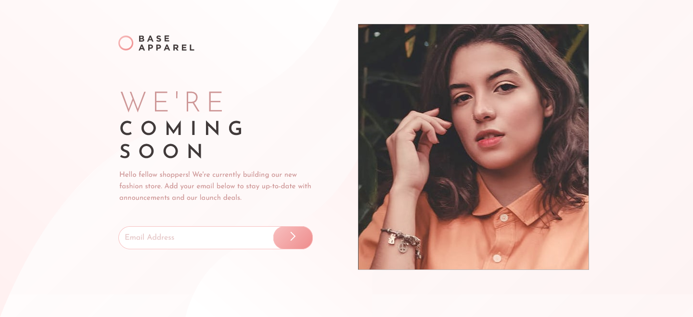
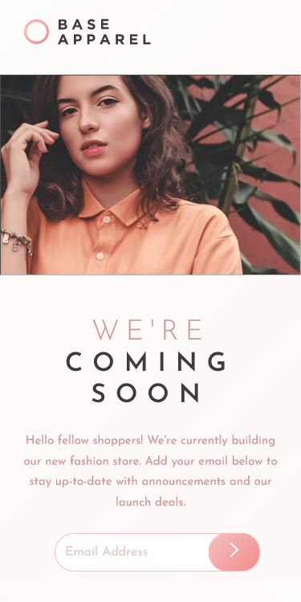

# Frontend Mentor - Base Apparel coming soon page
Esta es la solución al reto de [Base Apparel coming soon page](https://www.frontendmentor.io/challenges/base-apparel-coming-soon-page-5d46b47f8db8a7063f9331a0). Los desafíos de Frontend Mentor ayudan a mejorar las habilidades de codificación mediante la construcción de proyectos realistas.

## Tabla de contenido

- [Información-general](#Información-general)
  - [El-desafío](#El-desafío)
  - [Capturas-de-pantalla](#Capturas-de-pantalla)
  - [Mi-proceso](#Mi-proceso)
  - [Construido-con ](#Construido-con)
  - [Lo-que-aprendí](#Lo-que-aprendí)
  - [Desarrollo-continuo](#Desarrollo-continuo)
  - [Recursos-utiles](#Recursos-utiles)
  - [Autor](#Autor)

## Información-general

### El-desafío

Los usuarios deben poder:

- Ver el diseño óptimo para la sección según el tamaño de pantalla de su dispositivo.
- desktop: 1440px.
- mobile: 375px.

### Capturas-de-pantalla

 

## Mi-proceso

### Construido-con 

- HTML5
- CSS personalizado
- Mobile-first workflow

### Lo-que-aprendí

- Seleccionar elementos por atributos: button[type="submit"] {}.
- Cambiar los estilos del atributo placeholder con su pseudo-clase: #input::placeholder{}.
- Utilizar la propiedad z-index para que la imágen utilizada de fondo quede en una capa por debajo del contenido de la página.
 

### Desarrollo-continuo

- Falta hacer validacion en el formulario.

### Recursos-utiles
- https://www.w3schools.com/
- https://developer.mozilla.org/en-US/docs/Web/CSS
- https://www.udemy.com/

## Autor

- Frontend Mentor - https://www.frontendmentor.io/profile/eduviana
- Email - eduardoviana83@gmail.com

